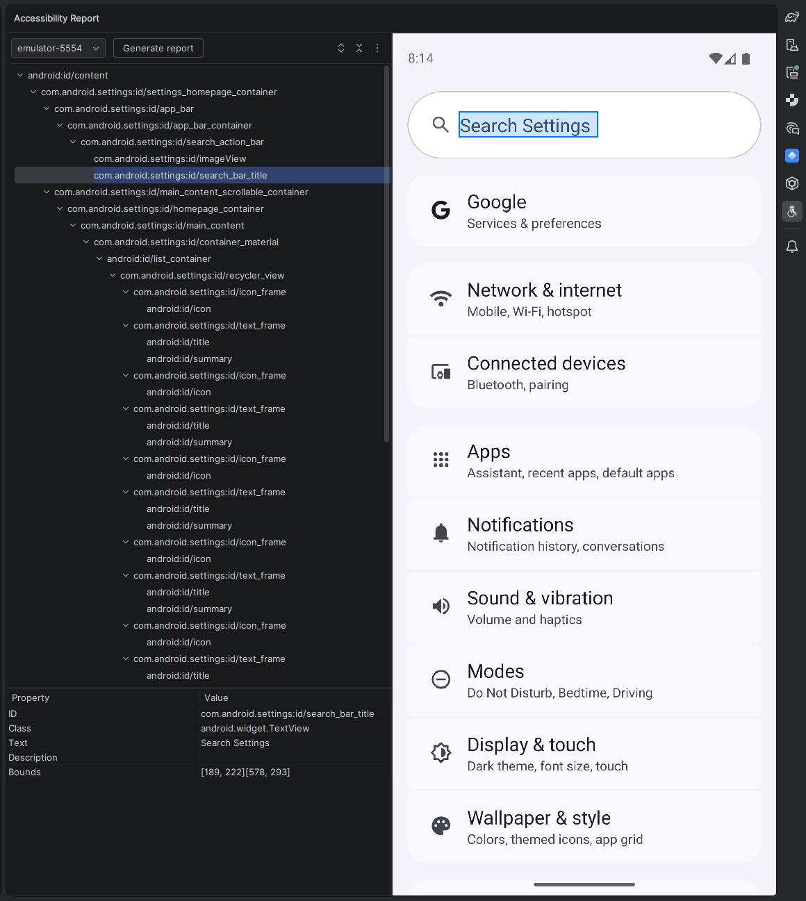
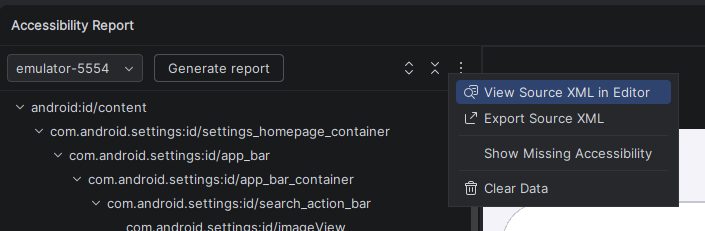

# Android Accessibility Report (ARP)

An IntelliJ / Android Studio plugin that analyzes the accessibility IDs of your Android app by dumping and visualizing the UI hierarchy.

## Features

- **UI Hierarchy Dump** — Uses `adb` and `uiautomator` to capture the current view hierarchy from a connected Android device or emulator.
- **Screenshot Overlay** — Takes a device screenshot and highlights UI elements as you browse the hierarchy tree.
- **Interactive Tree View** — Displays the parsed UI hierarchy in a navigable tree with expand/collapse controls.
- **Properties Table** — Shows element details (resource ID, class, text, content description, bounds) for the selected node.
- **Multi-device Support** — Detects all connected devices and lets you choose which one to inspect.

## Screenshots





## Requirements

- **IntelliJ IDEA / Android Studio** 2024.3 or later
- **Android SDK** with `adb` available (resolved automatically via `local.properties` or system PATH)
- A connected Android device or running emulator with USB debugging enabled

## Installation

1. Build the plugin:
   ```bash
   ./gradlew buildPlugin
   ```
2. In your IDE go to **Settings → Plugins → ⚙️ → Install Plugin from Disk…** and select the ZIP from `build/distributions/`.

Alternatively, install directly from the JetBrains Marketplace once published.

## Usage

1. Open the **Accessibility Report** tool window (right sidebar).
2. Select a connected device from the dropdown.
3. Click the **Refresh** button to capture the current screen.
4. Browse the UI hierarchy tree — click any node to see its properties and highlight it in the screenshot.

## Project Structure

```
src/main/kotlin/
├── AdbController.kt      # Manages adb commands (device list, UI dump, screenshot)
├── Node.kt               # Data classes for UI hierarchy nodes and bounds
├── UIAutomatorParser.kt   # Parses uiautomator XML dump into Node tree
└── ToolWindow.kt          # Tool window UI (tree, table, screenshot panel)
```

## Building

The project uses the [IntelliJ Platform Gradle Plugin](https://plugins.jetbrains.com/docs/intellij/tools-intellij-platform-gradle-plugin.html):

```bash
./gradlew buildPlugin   # Build distributable ZIP
./gradlew runIde        # Launch a sandboxed IDE with the plugin loaded
./gradlew test          # Run unit tests
```

## Acknowledgements

This project was made with the help of [Junie](https://www.jetbrains.com/junie/), an AI coding agent by JetBrains.

## License

© Přemysl Talich
