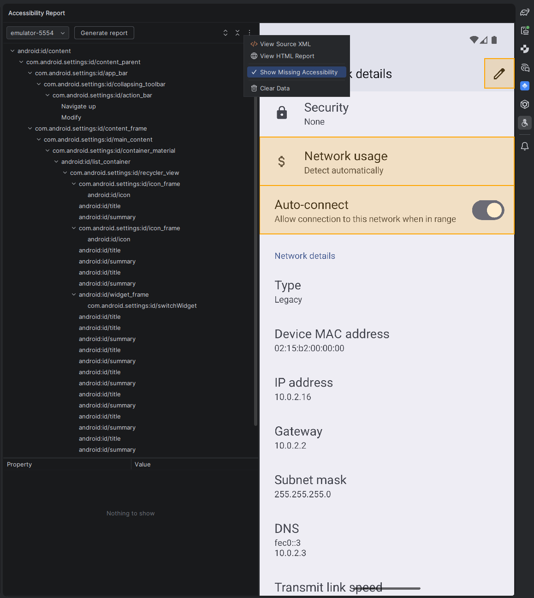
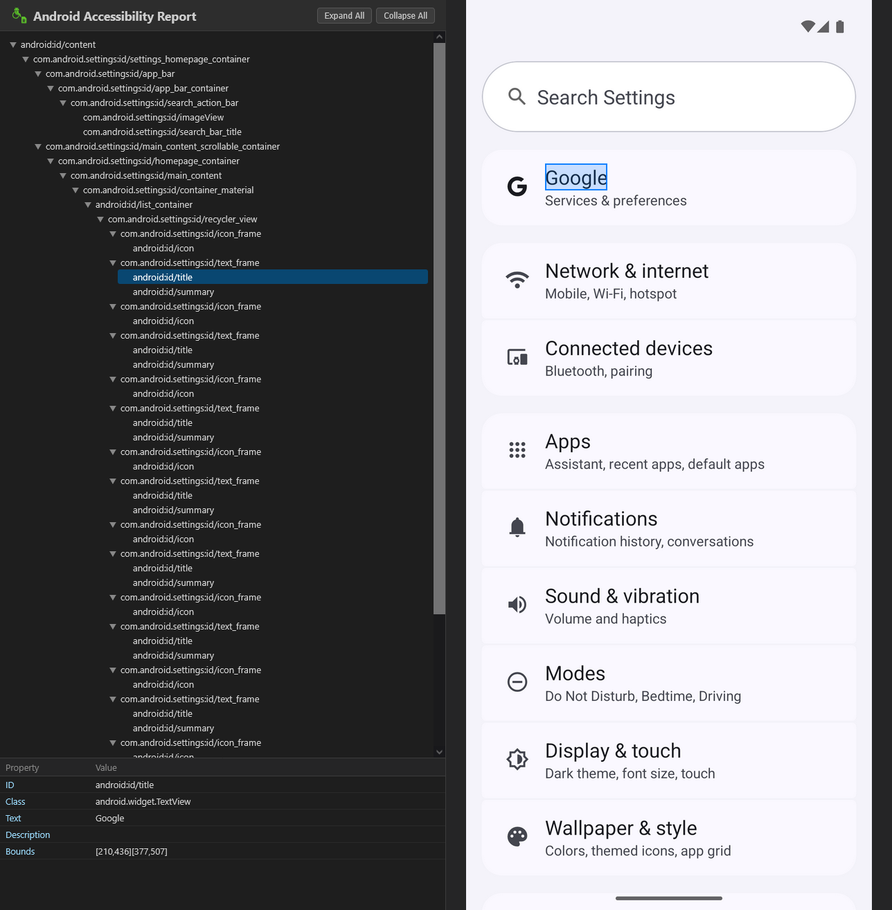

# Android Accessibility Report (ARP) [](https://plugins.jetbrains.com/plugin/31810-android-accessibility-report)

An Android Studio plugin that analyzes the accessibility IDs of your Android app by dumping and visualizing the UI hierarchy.


## Features

- **UI Hierarchy Dump** — Uses `adb` and `uiautomator` to capture the current view hierarchy from a connected Android device or emulator.
- **Screenshot Overlay** — Takes a device screenshot and highlights UI elements as you browse the hierarchy tree.
- **Interactive Tree View** — Displays the parsed UI hierarchy in a navigable tree with expand/collapse controls.
- **Properties Table** — Shows element details (resource ID, class, text, content description, bounds) for the selected node.
- **Multi-device Support** — Detects all connected devices (including AVDs with their display names) and lets you choose which one to inspect via a toolbar combo box.
- **Show Missing Accessibility** — Highlights UI elements with missing accessibility info. Specifically, it flags elements that:
    - Are missing a `resource-id`, **and**
    - Are either a `TextView` (`android.widget.TextView`) or a `clickable` element.
    - **Exception:** `TextView` nodes without a `resource-id` are excluded when nested directly inside a clickable parent that already has a `resource-id`.

  This helps you quickly identify and fix accessibility gaps.
- **View HTML Report** — Exports the accessibility report as a self-contained HTML file to `build/reports/accessibility/report.html` and opens it in the browser.
- **View Source XML** — Exports the raw UI Automator XML dump to `build/reports/accessibility/source.xml` and opens it in the editor.

## Screenshots






## Requirements

- **Android Studio** 2024.3 or later
- **Android SDK** configured in Android Studio (ADB is resolved automatically via Android Studio's built-in SDK integration)
- A connected Android device or running emulator with USB debugging enabled

## Installation

1. Build the plugin:
   ```bash
   ./gradlew buildPlugin
   ```
2. In your IDE go to **Settings → Plugins → ⚙️ → Install Plugin from Disk…** and select the ZIP from `build/distributions/`.

Alternatively, install directly from the JetBrains Marketplace once published.

## Usage

1. Open the **Accessibility Report** tool window (right sidebar).
2. Select a connected device from the dropdown.
3. Click **Generate report** to capture the current screen and build the UI hierarchy.
4. Browse the UI hierarchy tree — click any node to see its properties and highlight it in the screenshot. You can also click directly on the screenshot to select the corresponding node.
5. Use **Show Missing Accessibility** (in the ⋮ menu) to highlight elements with missing accessibility info on the screenshot.
6. Use **View HTML Report** (in the ⋮ menu) to export the report to `build/reports/accessibility/report.html` and open it in your browser.
7. Use **View Source XML** (in the ⋮ menu) to inspect the raw UI Automator XML dump in the editor.
8. Use **Clear Data** (in the ⋮ menu) to reset the tool window.

## Project Structure

```
src/main/kotlin/
├── AdbController.kt      # Manages adb commands (device list, UI dump, screenshot)
├── Node.kt               # Data classes for UI hierarchy nodes and bounds
├── UIAutomatorParser.kt   # Parses uiautomator XML dump into Node tree
├── HtmlReportGenerator.kt # Generates a self-contained HTML accessibility report
└── ToolWindow.kt          # Tool window UI (tree, table, screenshot panel)
```

## Building

The project uses the [IntelliJ Platform Gradle Plugin](https://plugins.jetbrains.com/docs/intellij/tools-intellij-platform-gradle-plugin.html):

```bash
./gradlew buildPlugin   # Build distributable ZIP
./gradlew runIde        # Launch a sandboxed IDE with the plugin loaded
./gradlew test          # Run unit tests
```

## Acknowledgements

This project was made with the help of [Junie](https://www.jetbrains.com/junie/), an AI coding agent by JetBrains.

## License

© Přemysl Talich
